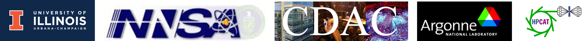

# Exploring Pressure and Temperature Induced Magnetostructural Phase Transformations in Ni50Mn50-xInx Alloys
## SSAP 2023
## Presentor: Brian Blankenau 
## Advisor: Dr. Elif Ertekin
## Affiliation: Mechanical Science and Engineering, University of Illinois at Urbana-Champaign, Chicago / DOE Alliance Center
Hello and thanks for stoping by my poster. If you scanned poster's QR code to get here its probably because I am away at the moment; so I created this website to walk you threw my reserch. 

  

